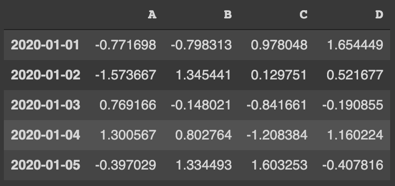
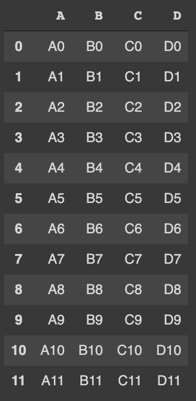

# Pandas basic
> Pandas problem-solving study for Data Analysis

## Introduction

> 본 directory 학습내용의 출처는 [FutureSkill](https://futureskill.io/)의 [Contents](https://futureskill.io/content/903ab63c-2b24-4be0-ba1c-a3ba34dce258)입니다.

 **Pandas** 는 파이썬 데이터 분석 라이브러리(Python Data Analysis Library)의 약자로서, 표 형태의 DataFrame 을 자유자재로 잘 다룰 수 있도록 도와주는 라이브러리이다. 이런 표 형태의 데이터를 정형 데이터(Structured Data, Tabular Data)라고 한다.

Pandas를 통해서 우리는 정형 데이터 분석을 손쉽게 할 수 있다. 따라서 본 contents를 통해 데이터 분석에서 가장 많이 사용하는 정형 데이터를 효과적으로 다루는 연습을 해 보고자 한다.

> p.s. pandas는 내부적으로 numpy array를 확장하여 구현되어 있다. numpy의 기본적인 개념인 모든 dtype이 동일한 것과, fancy indexing, broadcasting 등을 모두 지원한다.

## Contents

1. pandas data structure
2. pandas data structure (2)
3. pandas data structure (3)
4. DataFrame method
5. DataFrame method (2)
6. DataFrame method (3)
7. DataFrame method (4)
8. DataFrame method (5)
9. sorting
10. indexing
11. indexing (2)
12. indexing (3)
13. indexing (4)
14. concat
15. concat (2)
16. read write panel data
17. read write panel data (2)
18. read write panel data (3)
19. missing values
20. missing values (2)
21. missing values (3)
22. missing values (4)
23. aggregating
24. aggregating (2)
25. aggregating (3)
26. pivot table

## Dataframes

본 study set 에서 쓰이는 dataframes는 다음과 같다.

- `df_A`

  열의 이름은 A, B, C, D이고 각 열마다 5개의 random한(임의의) 숫자를 원소로 하는 DataFrame에, index로 2020년 1월 1일 부터 2020년 1월 5일까지의 날짜를 지정한 코드

  ~~~python
  import pandas as pd
  import numpy as np
  
  from datetime import datetime
  dt_index = pd.date_range('2020-01-01', periods=5)
  
  ar = np.random.randn(5,4)
  df = pd.DataFrame(data = ar, columns=['A','B','C','D'], index = dt_index)
  df
  ~~~

    

- `df_b`

  ~~~python
  import pandas as pd
  import numpy as np
  
  df = pd.DataFrame(columns=list('ABCD'))
  for i in range(12):
    df.loc[i] = ['A'+str(i), 'B'+str(i), 'C'+str(i),'D'+str(i)]
  df
  ~~~

    

> **reference** [FutureSkill 김용담 creator](https://futureskill.io/content/79eba49a-178d-41be-8f88-137a5127742d/question/ced42779-2980-46d6-90a5-8d4d2f1e6c61)

---

#### Contents

- [Future Skill](https://futureskill.io/)

#### Course
- [Youtube Minsuk Heo 허민석](https://www.youtube.com/channel/UCxP77kNgVfiiG6CXZ5WMuAQ)
  - [[Pandas 강의\] 팬더스, 데이터프레임, 시리즈 알아보기](https://www.youtube.com/watch?list=PLVNY1HnUlO26Igldy2Q6Nb2LZbpQWTyle&v=pFXipjh0ghw&feature=emb_logo) 

#### Editor
- [**Colab**](https://colab.research.google.com/) / PyCharm
